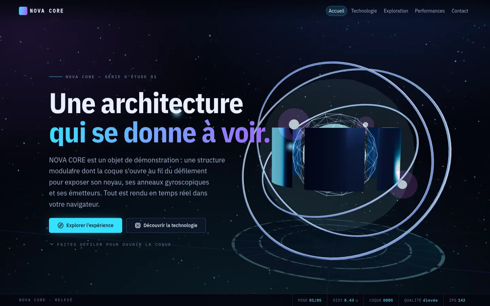
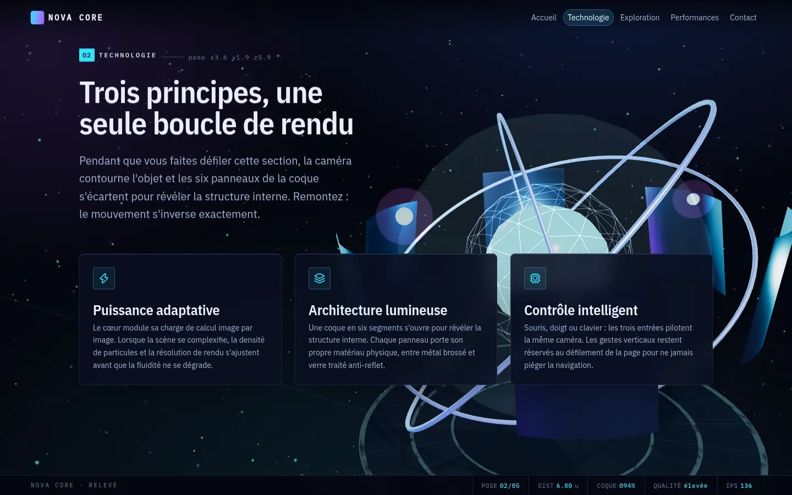
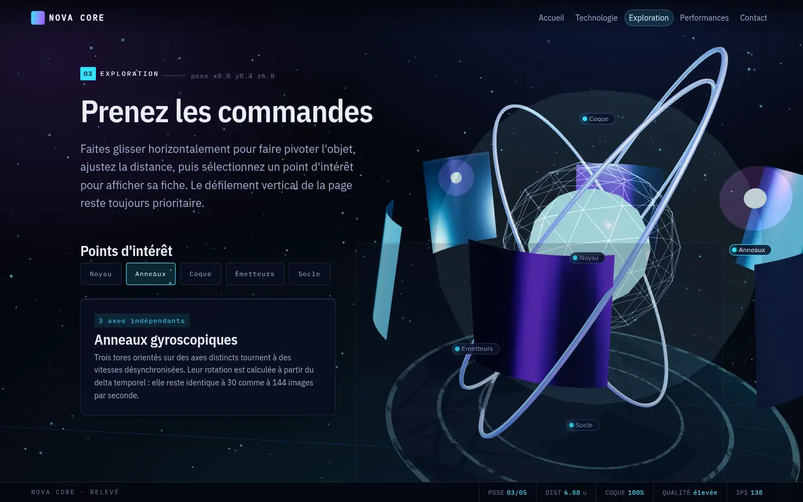
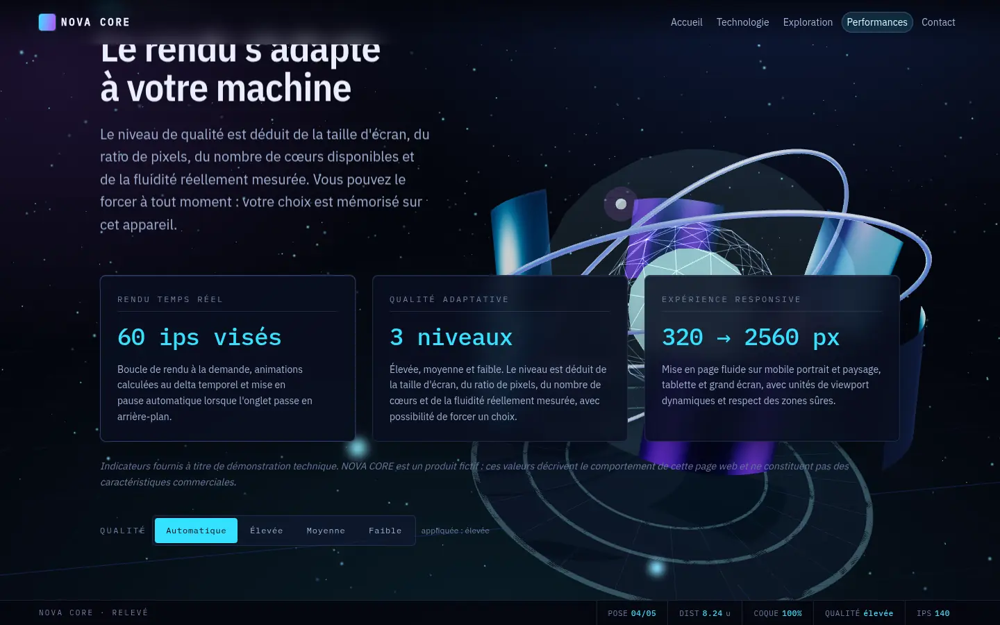
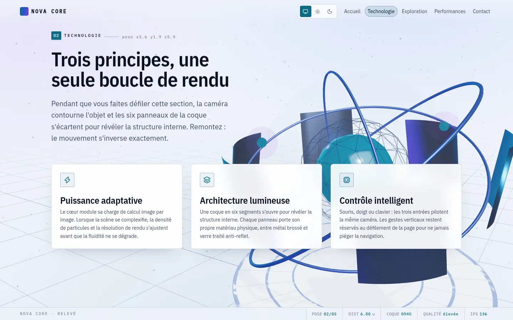
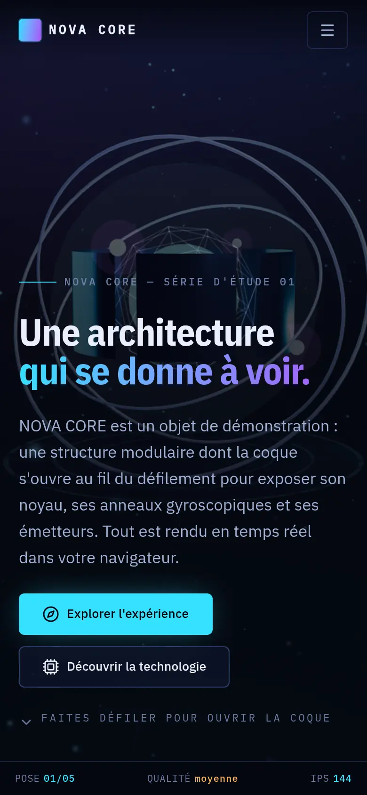
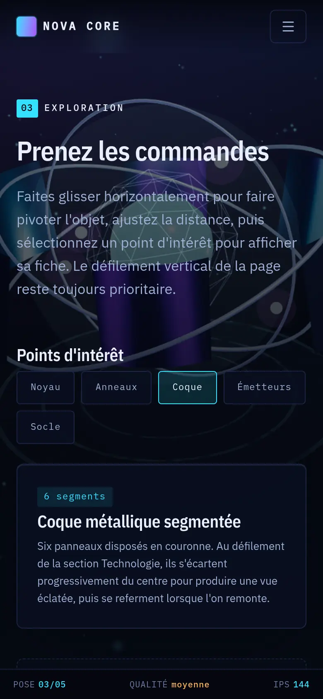
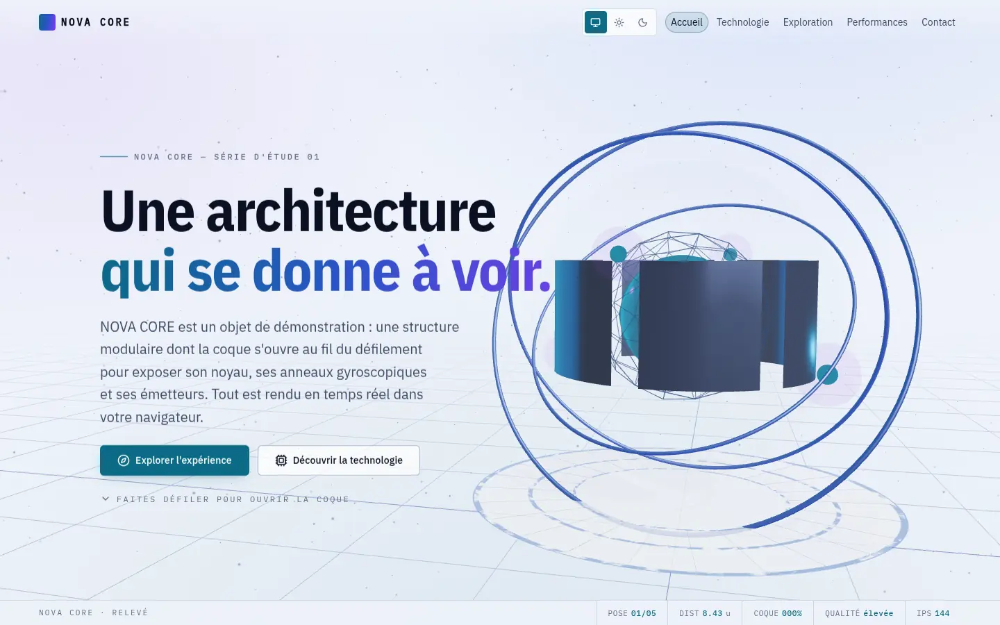

# NOVA CORE — site vitrine 3D interactif

Démonstration complète d'un site vitrine 3D immersif, construit avec **React**,
**TypeScript**, **Three.js**, **React Three Fiber** et **GSAP ScrollTrigger**.

Le projet n'est pas une scène de test : c'est un site vitrine réel, doté d'un
écran de chargement, d'une caméra cinématique pilotée par le défilement, d'une
vue éclatée de l'objet, d'une zone d'exploration interactive, d'un mode de
qualité adaptatif à trois niveaux, d'un repli complet sans WebGL, d'une
accessibilité soignée et d'une suite de tests unitaires et de bout en bout.

L'objet central, **NOVA CORE**, est un produit fictif entièrement procédural :
il est composé de primitives Three.js et ne dépend d'aucun fichier externe. Le
site fonctionne donc hors ligne et n'appelle aucun service tiers.

**→ Voir le site en ligne : <https://zeptoniator.github.io/immersive-3d-showcase/>**



---

## Sommaire

- [Aperçu](#aperçu)
- [Technologies](#technologies)
- [Prérequis](#prérequis)
- [Installation](#installation)
- [Lancement en développement](#lancement-en-développement)
- [Compilation de production](#compilation-de-production)
- [Prévisualisation](#prévisualisation)
- [Tests](#tests)
- [Commandes disponibles](#commandes-disponibles)
- [Structure du projet](#structure-du-projet)
- [Direction artistique](#direction-artistique)
- [Thème clair et sombre](#thème-clair-et-sombre)
- [Personnalisation des couleurs](#personnalisation-des-couleurs)
- [Remplacer l'objet procédural par un modèle GLB](#remplacer-lobjet-procédural-par-un-modèle-glb)
- [Optimiser un modèle avec Blender](#optimiser-un-modèle-avec-blender)
- [Réglage des niveaux de qualité](#réglage-des-niveaux-de-qualité)
- [Résoudre les problèmes WebGL sous Ubuntu](#résoudre-les-problèmes-webgl-sous-ubuntu)
- [Déploiement](#déploiement)
- [Accessibilité](#accessibilité)
- [Crédits et licences](#crédits-et-licences)

---

## Aperçu

Le site se compose de cinq sections :

| Section          | Rôle                                                                                                                                                                                         |
| ---------------- | -------------------------------------------------------------------------------------------------------------------------------------------------------------------------------------------- |
| **Accueil**      | Identité du produit, promesse, deux appels à l'action, parallaxe de caméra au pointeur.                                                                                                      |
| **Technologie**  | Trois piliers techniques. Au défilement, la caméra contourne l'objet et les six panneaux de la coque s'écartent pour produire une vue éclatée.                                               |
| **Exploration**  | Surface de contrôle : rotation à la souris, au doigt et au clavier, zoom borné, cinq points d'intérêt avec fiche descriptive, réinitialisation de la caméra et mise en pause des animations. |
| **Performances** | Indicateurs de démonstration et sélecteur manuel de qualité graphique.                                                                                                                       |
| **Contact**      | Appel à l'action, bouton de redémarrage de l'expérience et fiche technique.                                                                                                                  |

### Captures d'écran

Toutes les captures ci-dessous sont prises sur le **build de production**, dans
un navigateur réel avec accélération matérielle. Le bandeau de relevé visible en
bas de chaque image affiche donc de vraies valeurs mesurées au moment du
déclenchement — y compris la fréquence d'images.

#### Technologie — la coque s'ouvre au défilement



L'index `02` et les coordonnées `pose x3.6 y1.9 z5.9` affichés à côté du titre
ne sont pas décoratifs : ils proviennent de la table qui pilote réellement la
caméra. Le relevé en bas confirme la même pose et l'ouverture de coque en cours.

#### Exploration — points d'intérêt et contrôle direct



Les marqueurs posés sur l'objet et la liste HTML de gauche pilotent la même
sélection. La liste reste le chemin de navigation au clavier, et elle subsiste
lorsque la 3D est indisponible.

#### Performances — qualité adaptative



#### Thème clair



Le mode clair n'est pas une inversion : l'objet 3D s'assombrit pour se détacher
du fond, alors qu'il s'éclairait sur fond noir. Le champ de particules et les
halos passent de la fusion additive à la fusion normale — voir
[Thème clair et sombre](#thème-clair-et-sombre).

#### Mobile — portrait

| Accueil                                                                                                                                                                                                                   | Exploration                                                                                                                                                                   |
| ------------------------------------------------------------------------------------------------------------------------------------------------------------------------------------------------------------------------- | ----------------------------------------------------------------------------------------------------------------------------------------------------------------------------- |
|  |  |

Le bandeau de relevé se réduit à trois valeurs, et les marqueurs 3D cèdent la
place à la seule liste HTML pour ne pas encombrer l'écran.

#### Repli sans WebGL


Aucun écran noir, aucune perte de contenu : seule la couche 3D disparaît. Le
relevé bascule sur `qualité repli` et n'affiche plus de distance caméra.

> Les captures sont regroupées dans `docs/captures/`. Une image sociale prête à
> l'emploi est fournie dans `public/og-image.png` (1200 × 630 px, générée
> localement).

---

## Technologies

| Domaine               | Choix                    | Version |
| --------------------- | ------------------------ | ------- |
| Build                 | Vite                     | 8       |
| Langage               | TypeScript (mode strict) | 6       |
| Interface             | React                    | 19      |
| Rendu 3D              | Three.js                 | 0.185   |
| Liaison React ↔ Three | @react-three/fiber       | 9       |
| Utilitaires 3D        | @react-three/drei        | 10      |
| Animation             | GSAP + ScrollTrigger     | 3.15    |
| État partagé          | Zustand                  | 5       |
| Routage               | React Router             | 7       |
| Icônes                | lucide-react             | 1       |
| Typographie           | IBM Plex (@fontsource)   | 5.3     |
| Qualité               | ESLint + Prettier        | 10 / 3  |
| Tests unitaires       | Vitest + Testing Library | 4 / 16  |
| Tests E2E             | Playwright               | 1.62    |

Aucune dépendance de post-traitement n'a été ajoutée : les halos lumineux sont
obtenus par des matériaux additifs internes à la scène, ce qui évite une passe
de rendu supplémentaire et allège nettement le mobile.

---

## Prérequis

- **Node.js ≥ 20.19** (LTS recommandée : 22 ou 24). `nvm` est le moyen le plus
  simple de gérer les versions sous Ubuntu.
- **npm ≥ 10**
- Un navigateur moderne supportant WebGL 2 (Firefox, Chrome, Chromium, Edge,
  Safari 15+).
- **Facultatif** : Blender ≥ 4.0 pour créer ou optimiser des modèles 3D. Il
  n'est pas nécessaire pour exécuter le site.

Vérification rapide :

```bash
node --version
npm --version
```

Installation de Node.js LTS via nvm si nécessaire :

```bash
curl -o- https://raw.githubusercontent.com/nvm-sh/nvm/v0.40.1/install.sh | bash
exec "$SHELL"
nvm install --lts
nvm use --lts
```

---

## Installation

```bash
git clone <url-du-depot> immersive-3d-showcase
cd immersive-3d-showcase
npm install
```

Pour exécuter les tests de bout en bout, télécharger le navigateur utilisé par
Playwright (aucun `sudo` requis, l'archive va dans `~/.cache/ms-playwright`) :

```bash
npx playwright install chromium
```

Si Playwright signale des bibliothèques système manquantes :

```bash
sudo npx playwright install-deps chromium
```

---

## Lancement en développement

```bash
npm run dev
```

Le serveur écoute sur <http://127.0.0.1:5173>. Pour y accéder depuis un autre
appareil du réseau local (téléphone, tablette) :

```bash
npm run dev -- --host
```

Vite affiche alors une adresse réseau du type `http://192.168.x.x:5173`.
N'exposez le serveur que sur un réseau de confiance : il ne comporte aucune
authentification.

---

## Compilation de production

```bash
npm run build
```

La commande exécute d'abord `tsc -b` (vérification de types stricte) puis la
compilation Vite. Le résultat est écrit dans `dist/`.

Le bundle est découpé pour tirer parti du cache navigateur :

| Fragment                | Contenu                        | Chargement   |
| ----------------------- | ------------------------------ | ------------ |
| `index-*.js`            | React, routeur, interface HTML | immédiat     |
| `gsap-*.js`             | GSAP et ScrollTrigger          | immédiat     |
| `ExperienceCanvas-*.js` | React Three Fiber, Drei, scène | à la demande |
| `three-*.js`            | Three.js                       | à la demande |

**Les visiteurs sans WebGL ne téléchargent jamais Three.js** : la couche 3D est
importée dynamiquement, et seulement après une détection positive.

---

## Prévisualisation

```bash
npm run preview
```

Sert le contenu de `dist/` sur <http://127.0.0.1:4173>. C'est la commande à
utiliser pour vérifier le build avant déploiement.

---

## Tests

### Tests unitaires (Vitest + Testing Library)

```bash
npm run test        # mode interactif
npm run test:run    # exécution unique
```

Ils couvrent :

- le rendu de l'interface principale et la présence des sections essentielles ;
- la hiérarchie des titres et le lien d'évitement ;
- le comportement du menu compact (ouverture, fermeture, `Échap`, `aria-controls`) ;
- la sélection de la qualité et sa mémorisation dans `localStorage` ;
- le repli WebGL (jsdom n'implémente pas WebGL : le chemin de repli est donc
  exercé pour de vrai) ;
- le respect de `prefers-reduced-motion` ;
- l'absence d'erreur de console au montage ;
- la logique de détection de qualité, la sonde WebGL et le store.

### Tests de bout en bout (Playwright)

```bash
npm run test:e2e         # exécution complète
npm run test:e2e:ui      # interface graphique de Playwright
```

Les tests s'exécutent sur le **build de production** servi par `vite preview`,
ce qui valide simultanément la compilation et les chemins de ressources. Deux
projets sont configurés : `desktop-chromium` (1440 × 900) et `mobile-chromium`
(Pixel 7).

Scénarios couverts : ouverture de la page, disparition de l'écran de chargement,
navigation vers chaque section, clic sur un point d'intérêt, sélection et
mémorisation du mode qualité après rechargement, mise en page mobile, absence de
WebGL simulée par neutralisation de `getContext`, et absence de débordement
horizontal sur chaque section.

> **Note sur la concurrence.** En environnement headless, WebGL passe par
> SwiftShader (rendu logiciel) : chaque navigateur sature un cœur. La
> configuration limite donc volontairement à deux workers. Augmenter cette
> valeur sur une machine à faible nombre de cœurs provoque des expirations de
> délai sans rapport avec un défaut du site.

---

## Commandes disponibles

| Commande               | Effet                                               |
| ---------------------- | --------------------------------------------------- |
| `npm run dev`          | Serveur de développement avec rechargement à chaud  |
| `npm run build`        | Vérification de types puis compilation dans `dist/` |
| `npm run preview`      | Sert le build de production                         |
| `npm run lint`         | ESLint sur tout le dépôt                            |
| `npm run lint:fix`     | ESLint avec correction automatique                  |
| `npm run typecheck`    | `tsc -b` sur les trois projets TypeScript           |
| `npm run test`         | Vitest en mode surveillance                         |
| `npm run test:run`     | Vitest en exécution unique                          |
| `npm run test:e2e`     | Playwright (construit et sert automatiquement)      |
| `npm run test:e2e:ui`  | Playwright en mode interactif                       |
| `npm run format`       | Prettier en écriture                                |
| `npm run format:check` | Prettier en vérification                            |

---

## Structure du projet

```text
immersive-3d-showcase/
├── docs/
│   └── captures/                 Captures d'écran de cette documentation
├── e2e/                          Tests Playwright
│   ├── helpers.ts
│   ├── no-webgl.spec.ts
│   └── showcase.spec.ts
├── public/                       Ressources servies telles quelles
│   ├── favicon.svg
│   ├── og-image.png
│   ├── robots.txt
│   └── site.webmanifest
├── src/
│   ├── assets/
│   │   ├── images/               Captures et visuels
│   │   ├── models/               Fichiers .glb / .gltf
│   │   └── textures/             Textures .ktx2 / .webp
│   ├── components/
│   │   ├── canvas/               Tout ce qui vit dans le Canvas
│   │   │   ├── CameraRig.tsx         Trajectoire et amortissement de caméra
│   │   │   ├── ExperienceCanvas.tsx  Configuration du Canvas
│   │   │   ├── HotspotMarkers.tsx    Marqueurs HTML ancrés dans la 3D
│   │   │   ├── LoadingReporter.tsx   Sonde de progression réelle
│   │   │   ├── NovaCore.tsx          Objet principal procédural
│   │   │   ├── ParticleField.tsx     Champ de particules (shader)
│   │   │   ├── QualityManager.tsx    Arbitrage du niveau de qualité
│   │   │   ├── SceneEnvironment.tsx  Brouillard, grille, carte d'environnement
│   │   │   └── SceneLights.tsx       Éclairage cinématique
│   │   ├── layout/
│   │   │   ├── Footer.tsx
│   │   │   └── SiteHeader.tsx
│   │   ├── sections/
│   │   │   ├── FinalSection.tsx
│   │   │   ├── HeroSection.tsx
│   │   │   ├── InteractiveSection.tsx
│   │   │   ├── PerformanceSection.tsx
│   │   │   └── TechnologySection.tsx
│   │   └── ui/
│   │       ├── ErrorBoundary.tsx
│   │       ├── LiveAnnouncer.tsx
│   │       ├── LoadingScreen.tsx
│   │       ├── QualitySelector.tsx
│   │       └── WebGLFallback.tsx
│   ├── hooks/
│   │   ├── useMediaQuery.ts          prefers-reduced-motion, prefers-contrast
│   │   ├── usePointerParallax.ts
│   │   ├── useScrollChoreography.ts  GSAP + ScrollTrigger
│   │   └── useSectionObserver.ts
│   ├── pages/
│   │   ├── HomePage.tsx
│   │   └── NotFoundPage.tsx
│   ├── scenes/
│   │   └── MainScene.tsx             Composition de la scène
│   ├── shaders/
│   │   └── particleShader.ts
│   ├── store/
│   │   ├── scrollState.ts            État mutable hors React (par image)
│   │   └── useExperienceStore.ts     État partagé (Zustand)
│   ├── styles/                       Jetons, base, ossature, composants
│   ├── tests/                        Tests unitaires + configuration
│   ├── types/
│   ├── utils/
│   │   ├── content.ts                Tout le contenu éditorial
│   │   ├── math.ts
│   │   ├── quality.ts
│   │   └── webgl.ts
│   ├── App.tsx                       Routage uniquement
│   └── main.tsx
├── ASSET_GUIDE.md                Guide d'intégration des ressources 3D
├── eslint.config.js
├── playwright.config.ts
├── tsconfig.app.json / .e2e.json / .node.json
└── vite.config.ts
```

### Deux couches indépendantes

L'architecture repose sur une séparation stricte :

1. **Le contenu HTML** est toujours rendu et porte l'intégralité de
   l'information.
2. **La scène 3D** est une couche fixe, décorative et interactive, placée
   derrière le contenu en `pointer-events: none`.

Conséquence directe : la scène ne capte jamais le défilement, et son échec
éventuel ne prive l'utilisateur d'aucun contenu.

### État : deux mécanismes distincts

| Besoin                                                       | Mécanisme                      | Pourquoi                                                                                                |
| ------------------------------------------------------------ | ------------------------------ | ------------------------------------------------------------------------------------------------------- |
| Scène prête, section active, qualité, pause, point d'intérêt | `useExperienceStore` (Zustand) | Changements discrets, peu fréquents, qui doivent provoquer un rendu React                               |
| Progression du défilement, orbite, zoom, pointeur            | `scrollState` (objet mutable)  | Valeurs mises à jour à chaque image ; les stocker dans React reconstruirait l'arbre 60 fois par seconde |

---

## Direction artistique

NOVA CORE n'est pas un produit en vente : c'est un spécimen d'étude présenté
sous instrument. Le vocabulaire visuel suit cette lecture plutôt que celui d'une
plaquette commerciale.

### Typographie

Une seule superfamille tenue sur trois rôles, la famille dessinée par IBM pour
sa documentation d'ingénierie :

| Rôle    | Fonte                           | Emploi                                                                 |
| ------- | ------------------------------- | ---------------------------------------------------------------------- |
| Titres  | IBM Plex Sans Condensed 600/700 | Étroite et verticale, façon cartouche de plan technique                |
| Corps   | IBM Plex Sans 400/500           | Lisibilité à l'écran                                                   |
| Données | IBM Plex Mono 400/500           | Chiffres, coordonnées, relevés — partout où l'alignement porte du sens |

Le contraste de chasse entre un titre étroit et un corps de largeur normale
suffit à établir la hiérarchie : ni empilement de graisses, ni couleurs
supplémentaires.

### Couleur

Le dégradé de marque n'apparaît qu'à **deux endroits** : la ligne d'accent du
titre d'accueil et la pastille de marque. Partout ailleurs le cyan est utilisé à
plat. Un dégradé répété sur chaque chiffre et chaque bouton finit par ne plus
rien signaler.

Une seule couleur chaude complète la gamme froide : l'**ambre de
signalisation** (`--color-signal`). Elle est réservée au bandeau de relevé et
n'apparaît que lorsqu'une valeur mesurée s'écarte du nominal — qualité
rétrogradée, fluidité basse. Elle porte donc une information, elle ne décore
rien.

### Numérotation des sections

L'index affiché à côté de chaque titre n'est pas une numérotation décorative. Il
provient de `CAMERA_POSES` (`src/utils/cameraPath.ts`), la table qui pilote
réellement la caméra : la page compte exactement autant de sections que la
trajectoire a de poses, et le numéro désigne l'endroit où se trouve la caméra
pendant qu'on lit ce texte. Les coordonnées affichées à côté sont celles de
cette pose. Un test vérifie que les deux listes restent alignées.

### Bandeau de relevé

C'est l'élément signature du site : un bandeau fixe en bas de fenêtre affichant
la pose courante, la distance caméra, l'ouverture de la coque, le niveau de
qualité appliqué et la fréquence d'images.

**Chaque valeur est réellement mesurée**, jamais simulée : la distance est celle
que `CameraRig` vient d'appliquer, l'ouverture est la variable qui écarte les
panneaux, les images par seconde sont comptées sur place. C'est la contrepartie
honnête des indicateurs fictifs de la section Performances — ceux-là décrivent
un produit imaginaire, ceux-ci décrivent ce que la machine fait à l'instant.

Le bandeau n'entraîne aucun rendu React : la boucle écrit directement dans le
`textContent` des cellules. Il est masqué aux lecteurs d'écran, ses valeurs
changeant plusieurs fois par seconde et toutes les informations utiles qu'il
résume étant déjà exposées en clair ailleurs dans la page.

---

## Thème clair et sombre

Le site propose trois réglages — **système**, **clair**, **sombre** — accessibles
depuis l'en-tête. Le choix est mémorisé sous la clé `nova-core:theme-preference`
dans `localStorage`. Trois états plutôt qu'une bascule : après un choix manuel,
une bascule à deux positions ne permettrait plus de revenir au réglage du
système d'exploitation.

La même vue dans les deux thèmes :

| Sombre — la console éclairée                                                                                              | Clair — la planche imprimée                                                                                                                         |
| ------------------------------------------------------------------------------------------------------------------------- | --------------------------------------------------------------------------------------------------------------------------------------------------- |
|  |  |

### Aucun clignotement au chargement

Un script synchrone de quelques lignes, en tête de `index.html`, lit la
préférence et pose `data-theme` sur `<html>` **avant le premier rendu**. Sans
lui, la page s'afficherait en sombre pendant une image avant de basculer en
clair. Ce script est volontairement autonome : il ne dépend d'aucun module et
survit à un échec de chargement du bundle. Un test de bout en bout vérifie que
le thème est correct dès le rechargement, avant même que l'application ne soit
prête.

### Le point difficile : le mode de fusion en WebGL

Adapter l'interface à un fond clair est une affaire de jetons CSS. Adapter la
**scène 3D** ne l'est pas.

En thème sombre, les halos, le champ de particules et les cercles du socle
utilisent `AdditiveBlending` : chaque pixel ajoute de la lumière au fond, ce qui
produit la lueur. Sur un fond clair, ajouter de la lumière à du quasi-blanc ne
change rien — ces éléments deviennent purement et simplement **invisibles**.

Le thème clair repasse donc en fusion normale, avec des couleurs sombres : ce
n'est plus de la lumière ajoutée mais de l'encre déposée. C'est aussi ce qui
donne sa cohérence à la direction artistique — la console éclairée d'un côté, la
planche imprimée de l'autre.

Trois autres inversions découlent du même raisonnement :

|                     | Thème sombre                          | Thème clair                                     |
| ------------------- | ------------------------------------- | ----------------------------------------------- |
| L'objet             | s'éclaire pour se détacher du noir    | s'assombrit pour se détacher du blanc           |
| Les liserés colorés | intenses, ils sculptent la silhouette | mesurés, sinon ils délavent l'objet             |
| Le socle            | translucide, l'ombre s'y voit peu     | opaque : les ombres portées deviennent lisibles |
| L'accent            | cyan pur (12:1 sur fond sombre)       | bleu-sarcelle profond (5,4:1 sur fond clair)    |

Le cyan de marque plafonne à 1,6:1 sur fond clair — illisible. Il survit
uniquement dans le dégradé de marque et dans la scène 3D, où il est une source
lumineuse et non un texte.

### Où se règlent les deux thèmes

| Couche                                                 | Fichier                     |
| ------------------------------------------------------ | --------------------------- |
| Interface (couleurs, surfaces, ombres, voiles)         | `src/styles/tokens.css`     |
| Scène 3D (matériaux, lumières, brouillard, particules) | `src/utils/scenePalette.ts` |
| Résolution, mémorisation, application au document      | `src/utils/theme.ts`        |
| Suivi des changements système                          | `src/hooks/useTheme.ts`     |

`scenePalette.ts` est le pendant 3D de `tokens.css` : aucun composant de la
scène ne code une couleur en dur. Un test vérifie que les deux palettes
déclarent exactement les mêmes réglages — un oubli produirait sinon un
`undefined` silencieux au rendu.

---

## Personnalisation des couleurs

Toutes les couleurs, espacements, rayons et durées sont regroupés dans
`src/styles/tokens.css`. Aucun composant ne code une couleur en dur.

```css
:root {
  --color-void: #04060e; /* fond le plus sombre */
  --color-electric: #3b73ff; /* bleu électrique */
  --color-cyan: #35e0ff; /* accent principal */
  --color-violet: #a855f7; /* accent secondaire */
  --gradient-brand: linear-gradient(100deg, var(--color-cyan), ...);
}
```

Pour changer l'identité visuelle du site, il suffit de modifier ce fichier.

Les couleurs de la **scène 3D** sont, elles, définies dans les matériaux :

- `src/components/canvas/NovaCore.tsx` — matériaux du noyau, des anneaux, de la
  coque et des émetteurs ;
- `src/components/canvas/SceneLights.tsx` — couleur et intensité des lumières ;
- `src/components/canvas/SceneEnvironment.tsx` — brouillard, grille et
  `Lightformer` de la carte d'environnement ;
- `src/shaders/particleShader.ts` — via les uniformes `uColorNear` et
  `uColorFar` dans `ParticleField.tsx`.

---

## Remplacer l'objet procédural par un modèle GLB

L'objet est isolé dans un seul composant, `NovaCore.tsx`. La hiérarchie de la
scène a été nommée dans cette optique (`NovaCore_Core`, `NovaCore_Shell`,
`NovaCore_Rings`, `NovaCore_Emitters`, `NovaCore_Base`).

1. Placer le fichier dans `src/assets/models/nova-core.glb`.
2. Créer un composant frère, par exemple `NovaCoreModel.tsx` :

```tsx
import { useGLTF } from '@react-three/drei'
import modelUrl from '../../assets/models/nova-core.glb?url'

export function NovaCoreModel() {
  const { scene } = useGLTF(modelUrl)
  return <primitive object={scene} />
}

useGLTF.preload(modelUrl)
```

3. Remplacer `<NovaCore … />` par `<NovaCoreModel />` dans
   `src/scenes/MainScene.tsx`.
4. Conserver l'échelle : le rayon utile de l'objet est d'environ **1,6 unité**,
   et le socle est posé à `y = -1,85`. Les positions des points d'intérêt
   (`src/utils/content.ts`) restent alors valables.

L'écran de chargement affichera automatiquement la progression réelle du
téléchargement : `LoadingReporter` est déjà branché sur le gestionnaire de
chargement de Three.js.

Le détail complet (compression Draco, Meshopt, KTX2, licences) figure dans
[`ASSET_GUIDE.md`](./ASSET_GUIDE.md).

---

## Optimiser un modèle avec Blender

Blender est **facultatif** : le site fonctionne sans lui. Installation sous
Ubuntu :

```bash
# Version des dépôts (simple, parfois en retard d'une version)
sudo apt install blender

# Version à jour, recommandée
sudo snap install blender --classic
```

Chaîne de travail résumée (procédure détaillée dans `ASSET_GUIDE.md`) :

1. Appliquer toutes les transformations : `Objet ▸ Appliquer ▸ Toutes les
transformations` (`Ctrl+A`). Un modèle exporté avec une échelle non
   appliquée arrivera à la mauvaise taille dans Three.js.
2. Réduire le nombre de polygones avec le modificateur _Decimate_ — viser moins
   de 150 000 triangles pour un objet principal destiné au web.
3. Utiliser des matériaux **Principled BSDF** uniquement : c'est le seul nœud
   traduit fidèlement en PBR glTF.
4. Nommer les objets de façon explicite : les noms sont conservés dans le GLB et
   permettent de cibler une partie précise depuis React.
5. Exporter en `glTF 2.0 (.glb)` avec _Compression_ → _Draco_ activée, en
   n'incluant que les objets sélectionnés.
6. Compresser les textures en KTX2 :
   `npx @gltf-transform/cli optimize entree.glb sortie.glb --texture-compress ktx2`

---

## Réglage des niveaux de qualité

Trois niveaux sont définis dans `src/utils/quality.ts` :

| Fonction                   |              Élevé |             Moyen |      Faible |
| -------------------------- | -----------------: | ----------------: | ----------: |
| Ratio de pixels            |              1 → 2 |           1 → 1,5 |    0,75 → 1 |
| Particules                 |              2 200 |               900 |         300 |
| Ombres                     | activées (1024 px) | activées (512 px) | désactivées |
| Halos additifs             |           complets |          complets |  désactivés |
| Réflexions d'environnement |                oui |               oui |         non |
| Détail géométrique         |                  3 |                 2 |           1 |
| Anticrénelage              |                oui |               oui |         non |

### Comment le niveau est choisi

`detectQualityLevel()` part d'un score de 100 et retire des points selon la
largeur d'écran, le ratio de pixels, le nombre de cœurs, la mémoire annoncée, la
présence d'un pointeur grossier (tactile) et la préférence de mouvement réduit.
Aucune lecture du user-agent n'est faite : c'est une donnée peu fiable et
facilement usurpée.

`QualityManager` surveille ensuite la fluidité réelle. Il ignore d'abord les
trois premières secondes — compilation des shaders et chargement du reste de la
page rendent cette phase non représentative — puis mesure par fenêtres de 1,5
seconde. Si **trois fenêtres consécutives** passent sous 38 images par seconde,
le niveau descend d'un cran et un message est annoncé aux lecteurs d'écran.

Le système ne remonte jamais automatiquement : une oscillation entre deux
niveaux serait plus gênante qu'un rendu légèrement prudent. L'utilisateur peut
toujours forcer un niveau plus élevé depuis la section Performances.

### Personnalisation

- **Modifier un préréglage** : éditer `QUALITY_PRESETS` dans
  `src/utils/quality.ts`.
- **Changer les seuils de détection** : ajuster les pénalités de
  `detectQualityLevel()`.
- **Changer le seuil de fluidité** : constantes `WARMUP_DELAY`, `FPS_FLOOR`,
  `SAMPLE_WINDOW` et `CONSECUTIVE_BAD_WINDOWS` dans
  `src/components/canvas/QualityManager.tsx`.

Le choix manuel de l'utilisateur (section Performances) prime toujours et est
mémorisé sous la clé `nova-core:quality-preference` dans `localStorage`.

---

## Résoudre les problèmes WebGL sous Ubuntu

### 1. Diagnostiquer

```bash
# Installer les outils de diagnostic OpenGL
sudo apt install mesa-utils

# Renderer OpenGL réellement utilisé
glxinfo -B

# Carte(s) graphique(s) détectée(s)
lspci | grep -Ei 'vga|3d'

# Pilote NVIDIA, le cas échéant
nvidia-smi
```

Dans le navigateur, ouvrir `about:support` (Firefox) ou `chrome://gpu`
(Chrome/Chromium) et vérifier que WebGL 2 est bien listé comme _matériel_.

### 2. Cas fréquents

| Symptôme                                                  | Cause probable                                        | Correction                                                                                                                                                                                     |
| --------------------------------------------------------- | ----------------------------------------------------- | ---------------------------------------------------------------------------------------------------------------------------------------------------------------------------------------------- |
| Le repli statique s'affiche alors que la machine a un GPU | Accélération matérielle désactivée dans le navigateur | Firefox : `about:config` → `webgl.force-enabled` = `true`, `layers.acceleration.force-enabled` = `true`. Chrome : `chrome://settings/system` → activer « Utiliser l'accélération matérielle ». |
| Rendu très lent, ventilateurs à fond                      | Rendu logiciel (llvmpipe / SwiftShader)               | `glxinfo -B` affiche `llvmpipe` : installer le pilote propriétaire adapté.                                                                                                                     |
| GPU NVIDIA ignoré sur portable hybride                    | Le navigateur utilise le GPU intégré                  | Lancer avec `__NV_PRIME_RENDER_OFFLOAD=1 __GLX_VENDOR_LIBRARY_NAME=nvidia firefox`, ou vérifier `prime-select query`.                                                                          |
| Écran noir puis repli après quelques secondes             | Perte du contexte WebGL                               | Le site gère le cas et bascule seul sur l'aperçu statique. Réduire la qualité aide sur les GPU limités.                                                                                        |
| Wayland + pilote propriétaire NVIDIA                      | Compositeur et pilote incompatibles                   | Tester une session Xorg, ou mettre à jour vers un pilote NVIDIA ≥ 555.                                                                                                                         |

### 3. Pilotes NVIDIA

```bash
ubuntu-drivers devices          # liste les pilotes recommandés
sudo ubuntu-drivers autoinstall # installe le pilote conseillé
sudo reboot
```

### 4. Vérifier depuis la ligne de commande

```bash
# Doit afficher le renderer matériel, pas « llvmpipe »
glxinfo -B | grep -i 'opengl renderer'
```

---

## Déploiement

Le site est **entièrement statique** : le contenu de `dist/` suffit.

### Chemin de base

C'est le seul point d'attention. Il est piloté par `VITE_BASE_PATH` :

```bash
# Racine d'un domaine (Vercel, Netlify, Cloudflare Pages, Nginx)
npm run build

# Sous-chemin (GitHub Pages)
VITE_BASE_PATH=/immersive-3d-showcase/ npm run build
```

### GitHub Pages

```bash
VITE_BASE_PATH=/<nom-du-depot>/ npm run build
npx gh-pages -d dist        # ou via une action GitHub officielle
```

Le routeur utilise `import.meta.env.BASE_URL` comme `basename` : la page 404 et
les liens internes restent corrects sous un sous-chemin. Ajouter un fichier
`dist/404.html` identique à `index.html` si des routes profondes sont utilisées.

### Cloudflare Pages

- Commande de build : `npm run build`
- Dossier de sortie : `dist`
- Variable d'environnement : `VITE_BASE_PATH=/`

### Vercel

- Framework détecté : Vite
- Commande de build : `npm run build`
- Dossier de sortie : `dist`

### Netlify

- Commande de build : `npm run build`
- Dossier de publication : `dist`
- Ajouter un fichier `public/_redirects` contenant `/*  /index.html  200` pour
  que les routes côté client fonctionnent.

### Serveur Nginx

```nginx
server {
    listen 80;
    server_name exemple.tld;
    root /var/www/immersive-3d-showcase;
    index index.html;

    # Toutes les routes sont servies par l'application
    location / {
        try_files $uri $uri/ /index.html;
    }

    # Les fichiers versionnés par empreinte peuvent être mis en cache longtemps
    location /assets/ {
        expires 1y;
        add_header Cache-Control "public, immutable";
    }
}
```

### Avant de publier

- Renseigner le `<link rel="canonical">` dans `index.html` avec l'URL réelle.
- Mettre à jour la ligne `Sitemap:` de `public/robots.txt`.
- Vérifier `npm run preview` en local.

---

## Accessibilité

- Structure sémantique complète : un seul `<h1>`, titres hiérarchisés, `<main>`,
  `<nav>` et `<footer>` nommés.
- Lien d'évitement vers le contenu principal, visible à la prise de focus.
- Navigation entièrement au clavier, focus visible sur tous les éléments
  interactifs, cibles tactiles d'au moins 44 px de haut.
- Le canvas porte `role="img"`, un nom accessible et une description textuelle
  détaillée (`#scene-description`) reprenant tout ce que la scène montre.
- Zone d'annonce discrète (`aria-live="polite"`) pour les changements de
  qualité, la sélection d'un point d'intérêt et la mise en pause.
- `prefers-reduced-motion` : parallaxe désactivée, trajectoire de caméra écrasée
  vers la pose d'accueil, révélations sans déplacement, durées ramenées à 1 ms.
- `prefers-contrast: more` : effets de verre supprimés, bordures et textes
  secondaires renforcés — dans les deux thèmes.
- `prefers-color-scheme` respecté par défaut, avec un choix manuel possible et
  mémorisé. Les deux thèmes ont leurs propres valeurs d'accent, calculées pour
  le contraste plutôt que reprises de l'autre.
- Sur petit écran, un voile fixe s'intercale entre la scène et le contenu, et
  les marqueurs posés sur l'objet sont masqués au profit de la liste HTML : le
  texte ne dépend jamais de ce qui est rendu derrière lui.
- **Aucune information n'est portée exclusivement par la 3D** : les points
  d'intérêt existent aussi sous forme de liste HTML, et le repli sans WebGL
  conserve titre, présentation, caractéristiques, appels à l'action et
  navigation.

---

## Crédits et licences

- **Code** : licence MIT, voir [`LICENSE`](./LICENSE).
- **NOVA CORE** est un produit **fictif**, créé pour cette démonstration. Les
  indicateurs affichés dans la section Performances décrivent le comportement de
  la page web et ne constituent pas des caractéristiques commerciales.
- **Ressources visuelles** : le favicon et l'image sociale
  (`public/og-image.png`) ont été créés localement pour ce projet et suivent la
  licence du dépôt. Aucune ressource externe n'est téléchargée à l'exécution.
- **Polices** : IBM Plex Sans, IBM Plex Sans Condensed et IBM Plex Mono,
  © IBM Corp., sous licence **SIL Open Font License 1.1**. Les fichiers sont
  fournis par les paquets `@fontsource`, compilés dans le bundle et servis
  depuis l'origine du site — aucune requête vers un service de polices distant,
  le site reste utilisable hors ligne.
- **Bibliothèques** : Three.js (MIT), React (MIT), React Three Fiber (MIT), Drei
  (MIT), Zustand (MIT), React Router (MIT), lucide-react (ISC),
  GSAP (licence standard « no charge » — vérifier les conditions de GreenSock
  pour un usage commercial : <https://gsap.com/licensing/>).

Toute ressource 3D ajoutée ultérieurement doit être libre de droits ou créée
localement, et sa provenance ainsi que sa licence doivent être documentées dans
[`ASSET_GUIDE.md`](./ASSET_GUIDE.md).
